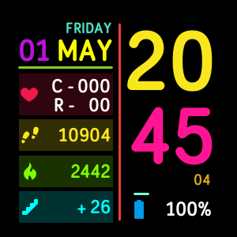

# Minimalist Clock | Clockface 

Clockface design for the Fitbit watches (Versa, Ionic), [Gallery Link](https://gallery.fitbit.com/details/b3329274-f051-445f-9a4b-032bd08ff09e). If you have any custom request let me know via [email](mailto:knightrider558@gmail.com)

**Note**
You must select the activities colour from the settings in order to see the coloured text when you complete the activities goal.

### Changelog v2.0
```
- [Fixed] - Typo error in week name (SATDAY) fixed.
- Code optimization.
```
### Changelog v1.7
```
- [Fixed] - Swipe up will reset the settings (colours).
- 100+ colour added in setting page.
- User can change the colour for all activities.
- Google analytic code added.
```
### Changelog v1.6
```
- Calculation error in the calories.
- More colours added in the settings page.
- Typo errors removed.
- Code optimization/rewritten.
- Animations added for the heartbeat.
- Cycle between activities in the last (elevation) box.
```

### Known issues
```
- Nothing
```

### Future enhancements
```
- Steps per hour counter will be added.
- Ability to change the order of activities.
```

## Screenshots

### Versa




### Ionic


